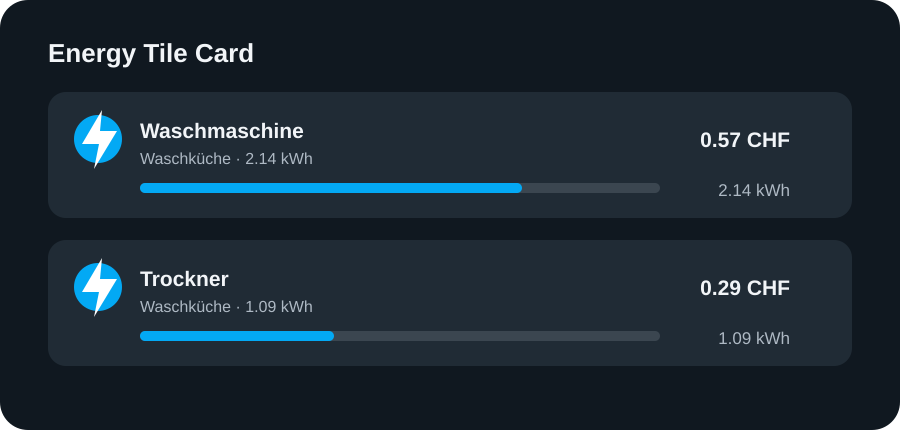

# HA Energy Tile Card

A Home Assistant dashboard card for energy consumption, costs, and percentage-based consumption shares.



## Features

- Reads recorder statistics for the active Energy dashboard period
- Supports a single sensor, a sensor list, or all visible energy sensors
- Displays consumption, optional costs, and a percentage bar
- Supports `Wh`, `kWh`, and `MWh`
- Opens the entity's more-info dialog when selected

## Requirements

- Home Assistant with an Energy dashboard and recorder statistics
- Energy sensors using `device_class: energy`
- A unit of `Wh`, `kWh`, or `MWh`
- `state_class: total` or `total_increasing`

## HACS installation

1. Open HACS and select **Custom repositories** from the three-dot menu.
2. Add `https://github.com/psym88/ha_energy-tile-card` with the **Dashboard** category.
3. Install **HA Energy Tile Card**.
4. Reload Home Assistant and clear the browser cache if necessary.

HACS normally registers this resource automatically:

```text
/hacsfiles/ha_energy-tile-card/ha_energy-tile-card.js
```

If it is missing, add it as a JavaScript module under **Settings → Dashboards → Resources**.

## Configuration

Display all visible energy sensors:

```yaml
type: custom:energy-tile-card
collection_key: energy_1
entities: energy
display_unit: kWh
show_zero: false
tap_action:
  action: more-info
```

Display selected sensors with the current price per kWh:

```yaml
type: custom:energy-tile-card
collection_key: energy_1
entities:
  - sensor.washing_machine_energy
  - sensor.dryer_energy
price_entity: sensor.electricity_price
currency: CHF
display_unit: kWh
name:
  - area
  - entity
state_content:
  - state
show_zero: false
```

Display a single sensor:

```yaml
type: custom:energy-tile-card
collection_key: energy_1
entity: sensor.total_energy
```

| Option | Required | Default | Description |
| --- | --- | --- | --- |
| `collection_key` | Yes | – | Energy data collection key, for example `energy_1` |
| `entity` / `entities` | Yes | – | One sensor, a sensor list, or `entities: energy` |
| `price_entity` | No | – | Entity containing the current price per kWh |
| `currency` | No | `CHF` | Currency code shown after cost values |
| `display_unit` | No | `kWh` | `Wh`, `kWh`, or `MWh` |
| `show_zero` | No | `true` | Whether to include sensors without consumption |
| `icon` | No | Sensor icon | One icon applied to every tile |
| `name` | No | `entity` | Name parts: `entity`, `device`, `area`, `floor` |
| `state_content` | No | `state` | Secondary content: `state`, `device_name`, `area_name`, `floor_name` |
| `tap_action.action` | No | `more-info` | `more-info` or `none` |

## Manual installation

Copy `dist/ha_energy-tile-card.js` to `/config/www/ha_energy-tile-card.js`, then register `/local/ha_energy-tile-card.js` as a JavaScript module.

## Development

```bash
npm run build
npm run check
```

Edit `src/energy-tile-card.js`, then run the build command to regenerate the HACS bundle in `dist/`.

## Language policy

Repository code, comments, user-facing strings, documentation, examples, release notes, and commit messages must be written in English. See [AGENTS.md](AGENTS.md).

## License

[MIT](LICENSE)
